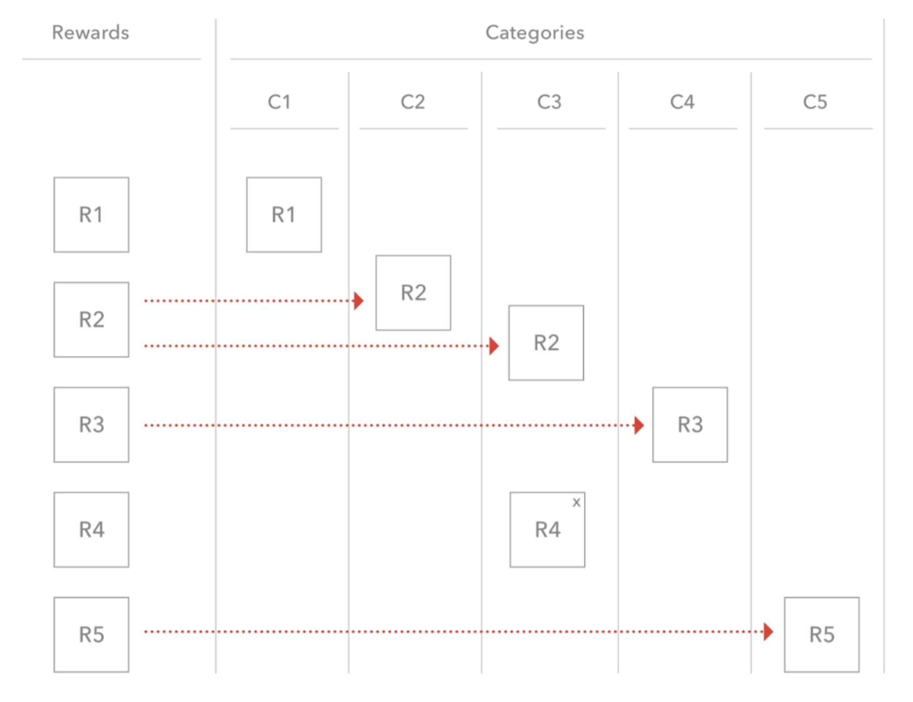

# Rewards_Categories

Conceptualized and developed a front-end application in 2 days utilizing MERN stack, Redux and GraphQL.

# Motivation

Create a front-end application that maps the rewards with the categories


# Requirements

1. A reward can be a part of multiple categories.

2. A reward can be removed from any category. You have a cross on the reward R4 which helps to remove the reward from that category only.
3. A reward can also be dragged between the swimlanes. In such a case, the reward gets removed from the former swimlane.
4. The reward should always stay in the reward swimlane so that you can keep dragging in one or more categories. (Each row is a swimlane. The red arrows show movement within a swimlane.)
5. Provide an undo/redo button.
6. Provide a “save” button that saves the arrangement to localStorage. Feel free to save to a backend if you’d like to.

# Result

[Live Demo](https://young-escarpment-47242.herokuapp.com/rewards)

[Video Demo](https://youtu.be/lMzcX2gnDiE)


# Usage

Choose the right branch in this repository to get the code for the different parts of the series.

Install all dependencies

```sh
npm install
```

Run the server

```sh
npm start
```
